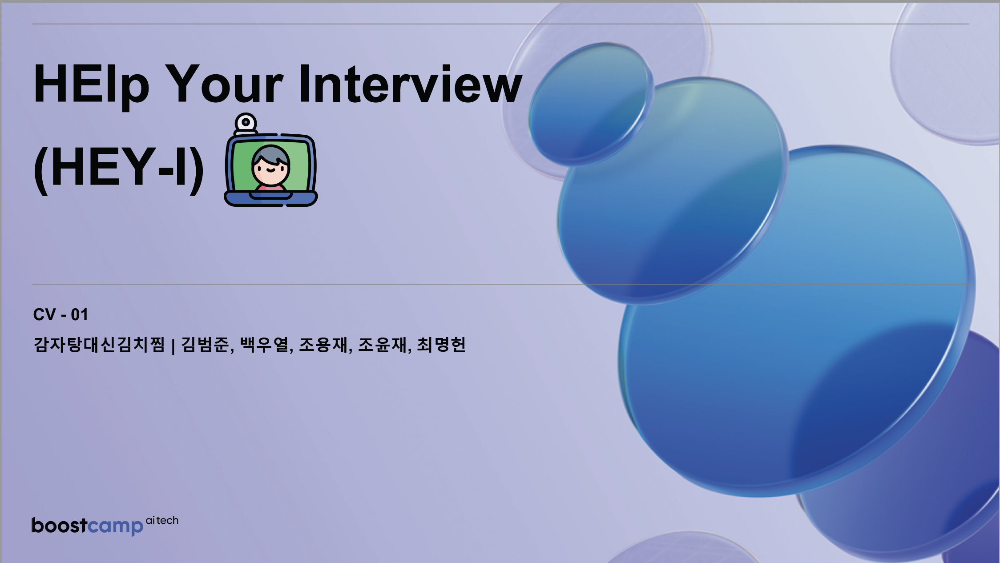
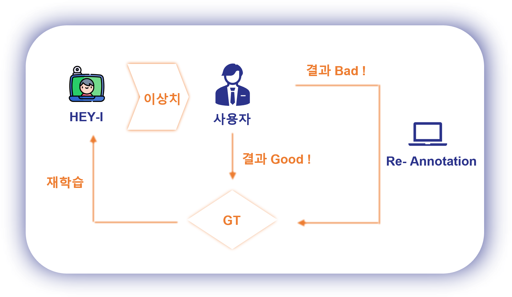
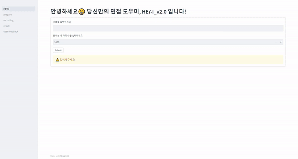
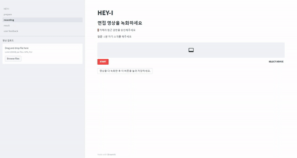
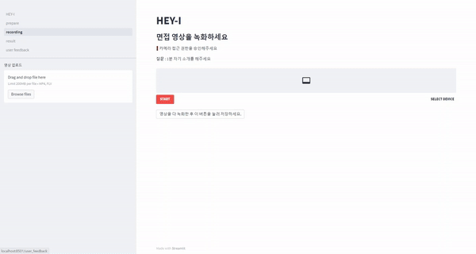
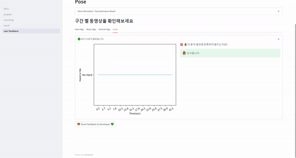

<div align="center">


  


  


  


</div>

# 👨‍🏫 HEY-I (HElp Your Interview)
## Project Summary
- 면접 진행 시 행동 분석을 통한 면접 도우미
- Facial Expression Recognition, Pose Estimation, Eye Tracking 사용해 얼굴 표정, 자세, 시선 처리에 대한 변화 및 이상치 전달
***
## Contributors🔥
| [김범준](https://github.com/quasar529) | [백우열](https://github.com/wooyeolBaek) | [조용재](https://github.com/yyongjae) | [조윤재](https://github.com/KidsareBornStars) | [최명헌](https://github.com/MyeongheonChoi) |
| :-: | :-: | :-: | :-: | :-: |
|  |  |  |  |  
| **Face - deepface, GCP - Cloud Storage & Cloud Run, Airflo** | **Pose - mediapipe, Backend - FastAPI, CI/CD - Github Action** | **Eye - gaze tracking, MongoDB, Backend - FastAPI** | **Pose - mediapipe&mmpose, CI/CD - Github Action** | **Face - Facial Emotion Recognition Modeling, Frontend- streamlit, Backend-FastAPI** |
***
## Architecture Flow Map


***
## Data Pipeline



***
## Demo

**녹화 준비**



**녹화 혹은 파일 업로드**



**전체 분석 결과**


**세부 분석 결과**


**피드백 전달**



***
## Model

**Facial Emotion Recognition**
- Model : EfficientNet B0
- Dataset : <a href='https://aihub.or.kr/aihubdata/data/view.do?currMenu=115&topMenu=100&aihubDataSe=realm&dataSetSn=82'>한국인 감정인식을 위한 복합 영상</a>
- Metric : 
  - Accuracy - 7 classes : 0.6285
  - Accuracy - 2 classes : 0.9112


**Pose Estimation**
- Model : Resnet50
- Dataset : <a href='https://aihub.or.kr/aihubdata/data/view.do?currMenu=115&topMenu=100&aihubDataSe=realm&dataSetSn=103'>수어 영상</a>
- Metric : Ap
***
## Folder Structure 📂
```
├── 📄README.md
├── 📄requirements.txt
├── 📂airflow
│    └── 📂dags
├── 📂DBconnect
├── 📂model
│    ├── 📂eye
|    │    └── 📂gaze_tracking
│    ├── 📂face
│    │    ├── 📂models
│    │    └── 📂utils
│    └── 📂pose
│         └── 📂mmmpose
├── 📂FastAPI
└── 📂streamlit
     └── 📂pages
```
***
## Reference

- <a href='https://github.com/serengil/deepface'>Deepface</a>
- <a href='https://github.com/open-mmlab/mmpose'>mmpose</a>
- <a href='https://github.com/HSE-asavchenko/face-emotion-recognition'>emotion pretrained</a>
- <a href='https://github.com/antoinelame/GazeTracking'>Gaze Tracking</a>
- <a href='https://github.com/google/mediapipe'>mediapipe</a>
