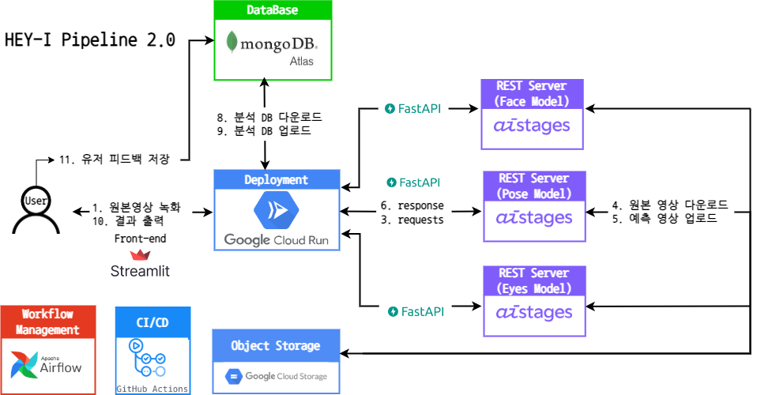
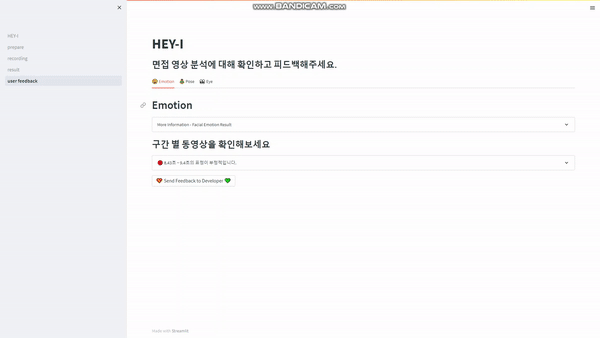
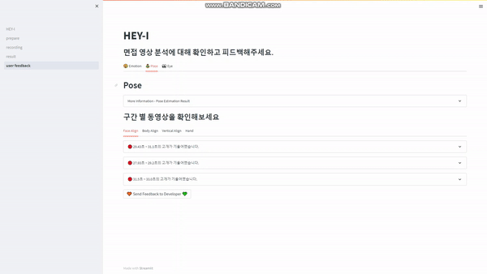
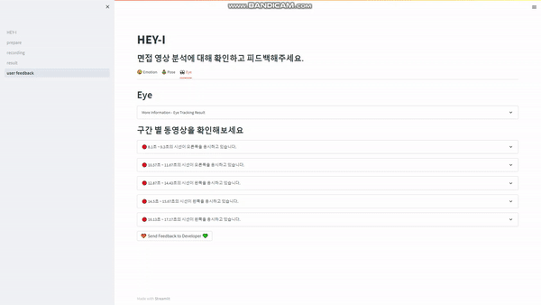

# 👨‍🏫 HEY-I (HElp Your Interview) 
## Project Summary
- 면접 진행 시 행동 분석을 통한 면접 도우미
- 시선 처리, 얼굴 표정, 자세에 대한 변화 및 이상치 전달
***

## Architecture Flow Map


***

## Demo
**전체 분석 결과**


**세부 분석 결과**


***
## Folder Structure 📂
```
├── README.md
├── airflow
│   └── dag
├── DBconnect
├── model
│   └──eye
|        └── gaze_tracking
│   └── face
│   └── pose
│        └── mmmpose
├── FastAPI
└── streamlit
```
***
## Member🔥
| [김범준](https://github.com/quasar529) | [백우열](https://github.com/wooyeolBaek) | [조용재](https://github.com/yyongjae) | [조윤재](https://github.com/KidsareBornStars) | [최명헌](https://github.com/MyeongheonChoi) |
| :-: | :-: | :-: | :-: | :-: |
|  |  |  |  |  |